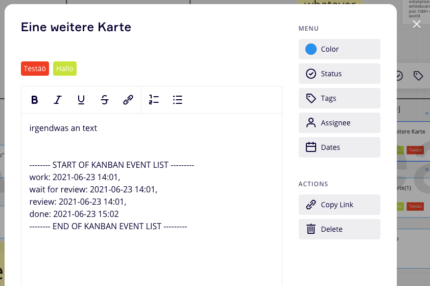
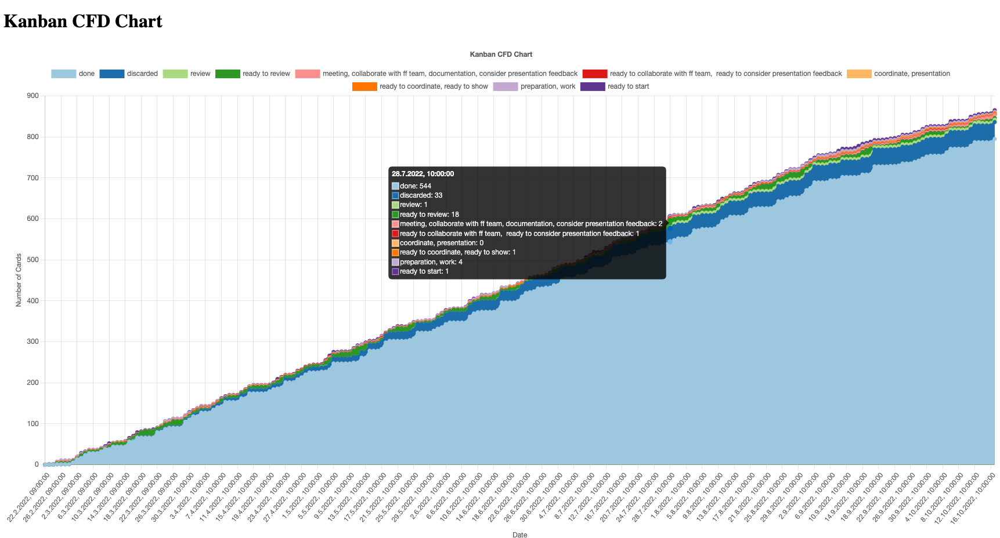
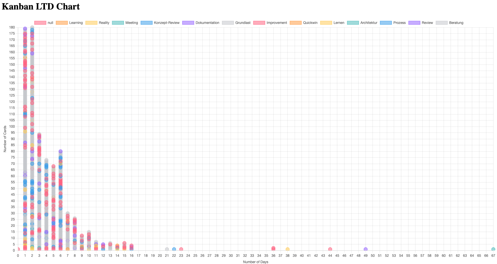

# Miro App: Kanban Statistics

This small projects adds tools for managing and analyzing a kanban board on virtual whiteboard in https://miro.com.


## Features
* Collect statistical data automatically when moving a Kanban Card over a board.


* Provide a Cumulative Flow Diagram based on the collected data. 
 

* Provide a Lead Time Distribution Diagram based on the collected data. 
 

* Provice a simple CVS export of the collected data.


## Development

### Build the Project

```sh
npm install
npm run build
npm run test
npm run lint
```

### Run a Local Version

Provide a the application on a simple local web server

```sh
npm run local
```

Afterwards, the result is available at the address http://localhost:8088

You can now follow the instructions in section "3. Create an app" of
[miro: How to build a web-plugin](https://developers.miro.com/v1.0/docs/create-your-app-in-miro).

### Testing

To run all tests once simply state

```sh
npm run test
```

To continuously monitor the tests while developing

```sh
npm run test:watch
```

### Linter and Code Style

Before pushing to github, please run all tests and the linter

```sh
npm run test
npm run lint
```

### Analyze the Code Complexity

```sh
npm run complexity
```

The command above uses the [complexity-report-html](https://github.com/igneel64/complexity-report-html) module to generate two reports

- `.complexity-report/app.html` shows an overview of complexity by file and function for the `app` folder
- `.complexity-report/test.html` shows an overview of complexity by file and function for the `test` folder

### Hint for Developers Using Windows

If you're using windows and git bash, you might run into the problem, that the build script creates a directory "-p" in your local repository instead of working directly.

The root cause of the problem is, that npm scripts are run in the default shell, which is usually the windows command prompt.

You can change this by configuring npm to use a different shell, e.g. the git bash:

```sh
npm config set script-shell "C:\\Program Files\\Git\\bin\\bash.exe"
```

*By the way, you can remove this directory by using `rmdir ./-p` - but you got this covered already, didn't you?*


## Deployment

### Option A: Run with npm.
As mentioned above, you can publish the contents the documents for providing this plugin locally via npm:

```bash
npm run loal
```

This will start a webserver at port 8088 on the local machine and publish everything necessary. If this port is publically accessible, you can use the plugin anywhere; otherwise, you can only use the plugin locally in a browser on your machine.


### Option B: Public with any webserver

After building (run `npm run build`) you can publish the contents of the folder out/htdocs with any webserver of your choise, to make the plugin available. Afterwards, you can create a plugin at miro refering to your own webserver.

Hint for your data protection officer: The relevant data does not leave your browser. The plugin is delivered in form of static content (html and js code) which is executed locally in your browser only accessing the API of miro.

